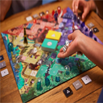

# BoardGame

A simple board game for training in ST.

## Quick links

- [**Explore the docs**](docs/README.md)
- [Report a defect](https://github.com/AgusSalvidio/BoardGame/issues/new?labels=Type%3A+Defect)
- [Request a feature](https://github.com/AgusSalvidio/BoardGame/issues/new?labels=Type%3A+Feature)

## License

- The code is licensed under [MIT](LICENSE).
- The documentation is licensed under [CC BY-SA 4.0](http://creativecommons.org/licenses/by-sa/4.0/).

## Installation

To load the project in a Pharo image follow this [instructions](docs/how-to/how-to-load-in-pharo.md).

## Contributing

Check the [Contribution Guidelines](CONTRIBUTING.md)
